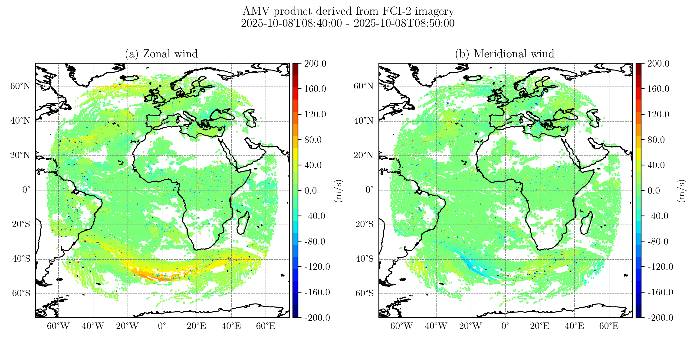

# VisuSat project : 

Python project dedicated to satellite data visualisation, handling and statistics.

AMVs derived from FCI-2 imagery :




## 🚀 Installation :

Clone the repository an install dependencies in virtual environnement :

```bash
git clone https://github.com/nsasso56-cell/VisuSat
cd VisuSat
uv sync
```

## 📬 Contact

If you have any questions or suggestions :

Author : Nicolas SASSO.
- e-mail : [n.sasso56@gmail.com](mailto:n.sasso56@gmail.com)
- LinkedIn : [linkedin.com/in/nicolas-sasso-6356ab172](http://www.linkedin.com/in/nicolas-sasso-6356ab172)
