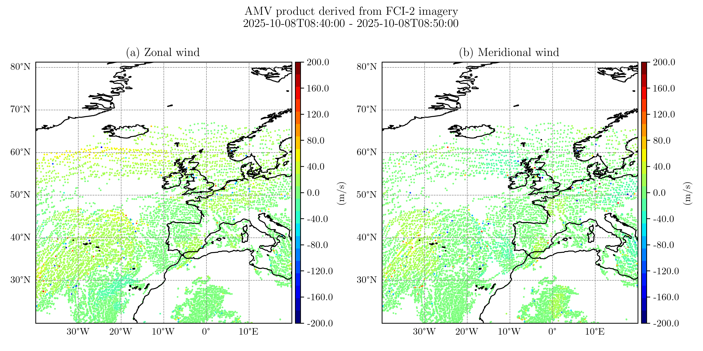

# 🛰️ VisuSat project : 

Python project dedicated to satellite data visualisation, handling and statistics.


## 🌍 Examples of vizualisations :

### 🌦️ EUMETSAT Data Store 
AMVs derived from FCI-2 imagery :




### 🌊 Copernicus Marine Service

Allows to download and visualize available datasets from Copernicus Marine datastore  (https://data.marine.copernicus.eu/products). 

Example of the the Sea Level Anomaly (in meter) from an aggregate of all available satellites data into Global Ocean Gridded Level4 product ([link](https://data.marine.copernicus.eu/product/SEALEVEL_GLO_PHY_L4_NRT_008_046/description)) :


Example of a Global Ocean Physics model output ([link](https://data.marine.copernicus.eu/product/GLOBAL_ANALYSISFORECAST_PHY_001_024/description)), from the Mercator global ocean analysis and forecast sytem. It shows the hourly mean of Sea Water Potential Temperature (degC) between 2025-10-27T11:00:00 and 2025-10-27T12:00:00.


## 🚀 Installation :

Clone the repository an install dependencies in virtual environnement :

```bash
git clone https://github.com/nsasso56-cell/VisuSat
cd VisuSat
uv sync
```

## 📬 Contact

If you have any questions or suggestions :

Author : Nicolas SASSO.
- e-mail : [n.sasso56@gmail.com](mailto:n.sasso56@gmail.com)
- LinkedIn : [linkedin.com/in/nicolas-sasso-6356ab172](http://www.linkedin.com/in/nicolas-sasso-6356ab172)
